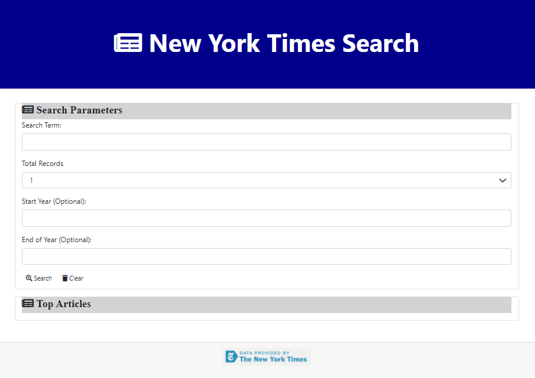

# New York Times Search Engine
  
  ## Table of Contents
  * [Description](#Description)
  * [Installation](#Installation)
  * [Usage](#Usage)
  * [License](#License)
  * [Contribute](#Contribute)
  * [Tests](#Tests)
  * [Questions](#Questions)
  ## Description
  I like reading the New York Times and its archives are a first draft of this countries history. I can search for old articles to read about the Lincoln Douglass Debates, the First World War, or Babe Ruth's rookie season. I wanted to write a simple search that uses the New York Times API to standardize my filters. I also wanted to take this opportunity to develop my skills in JQUERY and Bootstrap. 
  The page can be found on GitHub at [NYTSearch](https://jrtwheeler.github.io/NYTSearch/).
  
  ## Installation
  Open the index.html file in a web browser and bookmark the url so it is easy to access.
  ## Usage Information
  The UI provides the user with prompts for a search term, the number of records returned, the start year and the end year. After the prompts are filled out, click the Search button. To clear the prompts, click the Clear button.
  ## License
  Copyright (c) Microsoft Corporation. All rights reserved.
  
  Licensed under the MIT license.
  ## Questions
  If you have any further questions, please contact me at jwheele1@gmail.com.
  My GitHub profile is [Github Repo](https://github.com/jrtwheeler).
